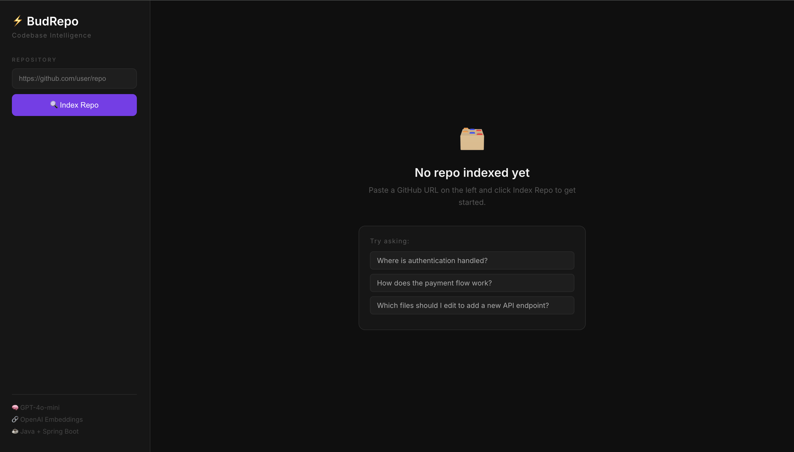

# ⚡ BudRepo — Codebase Onboarding Companion

> An AI-powered tool that lets you chat with any GitHub codebase in plain English.



---

## 🎯 The Problem

Joining a new codebase takes weeks. There's no interactive guide to how a repo actually works. Engineers waste days reading files, asking teammates, and guessing where things live.

**BudRepo solves this** — point it at any GitHub repo and ask questions instantly.

---

## 🚀 Demo

<!-- PHOTO: Add a GIF or screen recording of the full flow here -->
<!-- Suggested: screen record ingesting a repo + asking 2-3 questions -->
<video controls src="assets/v1.mov" title="Title"></video>

### Example questions you can ask:
- *"Where is authentication handled?"*
- *"How does the payment flow work?"*
- *"Which files should I edit to add a new API endpoint?"*

---

## 🧠 How It Works (RAG Pipeline)

```
GitHub URL
   → JGit Clone
   → Read & Chunk .java files (200 lines/chunk)
   → OpenAI Embeddings (text-embedding-3-small)
   → Stored in memory as vectors

User Question
   → Embed question
   → Cosine Similarity Search → Top 3 relevant chunks
   → GPT-4o-mini → Plain English Answer
```


---

## 🛠️ Tech Stack

| Layer | Technology |
|---|---|
| Backend | Java 17, Spring Boot |
| AI | OpenAI GPT-4o-mini, text-embedding-3-small |
| Git Integration | JGit |
| JSON Parsing | Gson |
| Frontend | React |

---

## ⚙️ Running Locally

### Prerequisites
- Java 17+
- Node.js 18+
- OpenAI API key

### Backend
```bash
cd bud-repo-backend
export OPENAI_API_KEY=your_key_here
./mvnw spring-boot:run
# Runs on http://localhost:8080
```

### Frontend
```bash
cd bud-repo-frontend
npm install
npm start
# Runs on http://localhost:3000
```

---

## 📡 API Endpoints

| Method | Endpoint | Description |
|---|---|---|
| POST | `/ingest?repoUrl=...` | Clone, chunk, and embed a GitHub repo |
| POST | `/chat` | Ask a question, get an AI answer |

---

## 📁 Project Structure

```
BudRepo/
├── bud-repo-backend/          # Spring Boot RAG pipeline
│   └── src/main/java/com/sujal/bud_repo/
│       ├── controller/        # REST endpoints
│       ├── service/           # Business logic
│       ├── CloneRepo.java
│       ├── ChunkFiles.java
│       ├── EmbeddingExample.java
│       ├── SimilaritySearch.java
│       └── AnswerGenerator.java
└── bud-repo-frontend/         # React chat UI
    └── src/App.js
```

---

## 🔮 Future Improvements
- Support for non-Java repos (Python, TypeScript)
- Persistent vector storage with PGVector
- Streaming responses
- GitHub OAuth for private repos